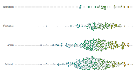
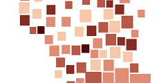
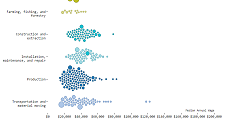

# d3.forceChart

A D3 plugin that simplifies using 
[force-directed layouts](https://github.com/mbostock/d3/wiki/Force-Layout) 
to make charts.
Useful when you want to prevent a chart's visual elements from overlapping.

### Examples

<table>
  <tr>
    <td><a href="http://bl.ocks.org/armollica/2dcfd66a64922990995f905aa0dc4d7b"></a></td>
    <td><a href="http://bl.ocks.org/armollica/5a728eea67694fba94d675dd036d6ecc"></a></td>
    <td><a href="http://bl.ocks.org/armollica/93491e923d72e81df769"></a></td>
  </tr>
</table>

### API Reference

*#* d3.**forceChart**()

Creates a new force chart generator. 

This generator has several getter/setter
methods that let you specify how you want the chart to render. Getter/setter
methods return an updated force chart generator which allows for method chaining.

*#* **forceChart**(*selection*, *data*)

Renders the force chart within `selection`, which should be an `<svg>` or 
`<g>` SVG element.
The second parameter, `data`, is an array containing the data that is
used to create the visual elements. When `forceChart` is called the following
properties will be added (or overwritten!) on each element of the array:
- x - x-coordinate of the current element
- y - y-coordinate
- r - radius or half-width depending on whether forceChart.shape("circle") or forceChart.shape("square")
- x0 - targeted x-coordinate
- y0 - targeted y-coordinate
- r0 - targeted r-coordinate

When this function is called `data.length` number `<g class="node">` elements 
will be appended to `selection`. Each `<g>` will be translated into the current (x,y)-position.
Each `<g>` is empty so you'll need to add an SVG shape element like a 
`<circle>`, `<rect>`, `<path>` or `<text>`. For example, this is how you would
add a `<circle>` to each `<g>` node and set its radius:

```javascript
var svg = d3.select("body").append("svg"),
    forceChart = d3.forceChart();
    
svg.call(forceChart, data)
  .selectAll(".node").append("circle")
    .attr("r", function(d) { return d.r; });
```

*#* forceChart.**size**([*width, height*])

Sets the width and height of the `forceChart`. If not specified, returns
the current size. Defaults to `[400, 300]`

*#* forceChart.**padding**([*padding*])

Sets the padding between each visual element (in pixels). If not specified, 
returns the current padding. Defaults to `3`.

*#* forceChart.**shape**([*shape*])

Sets the shape of each visual element. Used when determining if elements are
colliding with one another. Can either be `"circle"` or `"square"`.
If not specified, returns the current shape. Defaults to `"circle"`.

Regardless of which shape is specified here, the user will have to add an
SVG shape elements to each `<g>` node. For example, you could set this shape
to `"square"` and append an `<text>` element to each `<g>` node.

*#* forceChart.**draggable**([*draggable*])

Sets whether each visual element should be draggable with the mouse 
(`true` or `false`). If not specified, returns the current draggable setting.
Defaults to `true`. For more detail see on the drag behavior see the API 
reference for the force layout's 
[drag feature](https://github.com/mbostock/d3/wiki/Force-Layout#drag).

Manually moving elements can be useful if your end goal is a static chart with 
a particular layout.
Elements can be arranged how you want and then the positions of the nodes
can be saved for use in the static chart. 

*#* forceChart.**tickUpdate**([*tickUpdate*])

Sets a function that will be called for every "tick" in the force chart's
animation. The `tickUpdate` function is called on each `<g>` node element after 
the node has been translated into its current position. If not specified, 
returns the current `tickUpdate` function. Defaults to doing nothing.

This can be useful if you want to have a visual indicator of how far off
a node is from its targeted position, for example by making the stroke blue
if the *x*-position is to the right of the targeted *x* and making it red
if it is to the left of its target:

```javascript
var errorScale = d3.scale.linear()
  .domain([-20, 0, 20])
  .range(["red", "white", "blue"]);

var forceChart()
  .tickUpdate(function(d) {
    var node = d3.select(this);
    
    node.select("circle")
      .style("stroke", function(d) { return errorScale(d.x0 - d.x); });
  });        
```

#### Targets

The *x*-, *y*- and *r*-target accessors set the *targeted* (x,y)-position and 
radius. There is no guarantee 
the element will be at its targeted position because there may be other 
elements vying for the same position. 
Often you will use the *x*-, *y*-, *r*-target accessor functions with
scales:

```javascript
var xScale = d3.scale.linear().range([0, width]),
    yScale = d3.scale.ordinal().rangeBands([height, 0]),
    rScale = d3.scale.linear().range([3, 10]);
    
var forceChart = d3.forceChart()
  .x(function(d) { return xScale(d.xVal); })
  .y(function(d) { return yScale(d.yVal) + yScale.rangeBand()/2; })
  .r(function(d) { return rScale(d.rVal); });
```

*#* forceChart.**x**([*x*])

Sets the *x*-target accessor to the specified function or constant number. If *x* is 
not specified, it returns the current *x*-accessor. Defaults to:

```javascript
function(d) { return d[0]; }
```

*#* forceChart.**y**([*y*])

Sets the *y*-target accessor to the specified function or constant number. If *y* is 
not specified, it returns the current *y*-accessor. Defaults to:

```javascript
function(d) { return d[1]; }
```

*#* forceChart.**r**([*r*])

Sets the *r*-target accessor to the specified function or constant number. If *r* is 
not specified, it returns the current *r*-accessor. Defaults to:

```javascript
function(d) { return d[2]; }
```

#### Gravity

The gravity strength determines how forceful each element will be when trying 
to reach the targeted (x, y)-coordinates and radius set in the 
*x*-, *y*- and *r*-target accessor functions. A higher gravity strength 
means the element is
more likely get to its target for that dimension. For example, if you care 
more about the *x*-axis accuracy than the *y*-axis accuracy you can set the 
*x*-gravity strength to a high value and the *y*-gravity strength to
a low value:

```javascript
var forceChart = d3.forceChart()
  .xGravity(10)
  .yGravity(1/10);
```
This is a reasonable thing to do when *x* is a continuous variable and
*y* is ordinal and defined by range bands.

You can also give some node elements more gravity than others.
For example, you can set the *x*-gravity strength to the radius of
each element, making it more likely for larger nodes to be in the
targeted *x*-position:

```javascript
var forceChart = d3.forceChart()
  .xGravity(function(d) { return d.r; });
```

*#* forceChart.**xGravity**([*xGravity*])

Sets the *x*-gravity strength accessor to the specified function or constant 
number. If not specified, returns the current *x*-gravity strength accessor.
Defaults to `1`.

*#* forceChart.**yGravity**([*yGravity*])

Sets the *y*-gravity strength accessor to the specified function or constant 
number. If not specified, returns the current *y*-gravity strength accessor.
Defaults to `1`.

*#* forceChart.**rGravity**([*rGravity*])

Sets the *r*-gravity strength accessor to the specified function or constant 
number. If not specified, returns the current *r*-gravity strength accessor.
Defaults to `1`.

#### Starting position

The *x*-, *y*- and *r*-start accessor functions determine where each visual
element will initially be layed out before moving toward its targeted value
as set in the *x*-, *y*- and *r*-target accessor functions. 
By default the (x, y)-coordinates
are jittered to reduce some of the initial overlapping.

*#* forceChart.**xStart**([*xStart*])

Sets the *x*-start accessor to the specified function or constant number. 
If not specified, returns the current *x*-start accessor. Defaults to:

```javascript
function(d) { return x(d) + 50*Math.random() - 25; }
```

*#* forceChart.**yStart**([*yStart*])

Sets the *y*-start accessor to the specified function or constant number. 
If not specified, returns the current *y*-start accessor. Defaults to:

```javascript
function(d) { return y(d) + 50*Math.random() - 25; }
```

*#* forceChart.**rStart**([*rStart*])

Sets the *r*-start accessor to the specified function or constant number. 
If not specified, returns the current *r*-start accessor. Defaults to:

```javascript
function(d) { return r(d); }
```